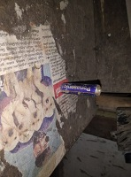
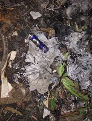
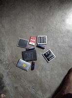
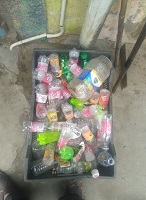
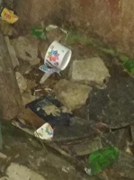
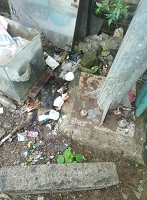
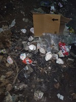
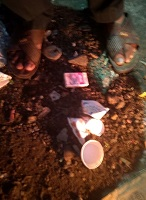
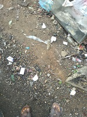

# Domestic Trash Dataset  

This dataset consists of images domestic trash/litter object like paper/plastic cups, batteries, razor, plastic bags etc.  

**Introduction**    
Dataset consists of images of domestic common trash objects in context. Images were captured under wide variety of lighting conditions, weather, indoor and outdoor. This dataset can be used for make trash/litter detection models, eco-friendly alternative suggestions, carbon footprint generation etc.      

**Dataset Features**  
* Various trash object classes  
* Has material labels  
* Captured by 5000+ unique users  
* Rich in diversity 
* Mobile phone view point    
* HD Resolution  
* Various lighting conditions  
* Indoor and Outdoor scene   

**Dataset Format**  
* Classification and detection annotations available   
* COCO, PASCAL VOC and YOLO formats  
* Approx. 9000 unique images  

**Sample Images**  
         

# Datacluster Labs Datasets

Datacluster Labs focuses on Crowd Data Collection through our managed crowd-sourcing platform - [Dailydata](https://play.google.com/store/apps/details?id=com.daily.data). 

We provide integrated services for your AI needs:  
* Data Collection  
* Data Curation  
* Data Annotation 

We deal with all types of multimedia data collection and annotation like images, videos, audio, text and surveys.

**To download full datasets or to submit a request for your dataset needs, please contact **contact@datacluster.in****  

To download the full datasets, please contact [contact@datacluster.in](contact@datacluster.in).  
Visit [www.datacluster.in](www.datacluster.in) to know more.
    

**Note:**  
**All the images are manually verified and are contributed by the large contributor base on our platform.** 